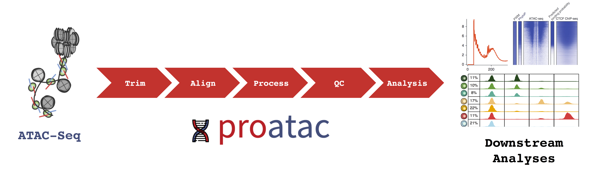

===================================================================================
Processing ATAC-Seq Data
===================================================================================
.. image:: https://badge.fury.io/py/proatac.svg
    :target: https://badge.fury.io/py/proatac
 
.. image:: https://travis-ci.org/buenrostrolab/proatac.svg?branch=master
    :target: https://travis-ci.org/buenrostrolab/proatac
    
.. image:: https://img.shields.io/badge/License-MIT-blue.svg
    :target: https://opensource.org/licenses/MIT

.. image:: https://zenodo.org/badge/71602064.svg
    :target: https://zenodo.org/badge/latestdoi/71602064
     
================
About
================

**proatac** is an open-source command-line toolkit that performs robust and scalable 
preprocessing of `ATAC-Seq data <http://www.nature.com/nmeth/journal/v10/n12/full/nmeth.2688.html>`_. 
Specifically, we've implemented our workflow using `Snakemake <https://www.ncbi.nlm.nih.gov/pubmed/22908215>`_,
a robust, scalable computational workflow platform. Various snakefiles are wrapped alongside meta-data annotations
and various object-oriented constructs and distributed as a `Python 3` package. The figure below provides a brief
overview of the functionality of the **proatac** pipeline. 

================
Installation
================
.. toctree:: content/Installation

================
Dependencies
================
.. toctree:: content/Dependencies

================
Annotating peaks
================
.. toctree:: content/Annotation
   
================
Author
================

The primary developer is `Caleb Lareau <https://caleblareau.github.io>`_ 
in the `Buenrostro Lab <http://buenrostrolab.com>`_.

================
Citation
================

If you use **proatac** in your research, please cite our tool at the following URL:
	
	``http://buenrostrolab.com/proatac``
	
================
Bugs / Errors
================

Please let us know if you find any errors/inconsistencies in the documentation or code
by filing a new `Github Issue <https://github.com/buenrostrolab/proatac/issues>`_.

